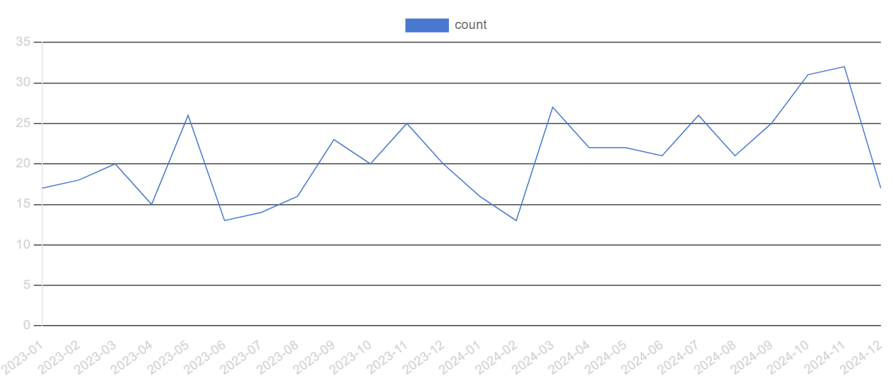
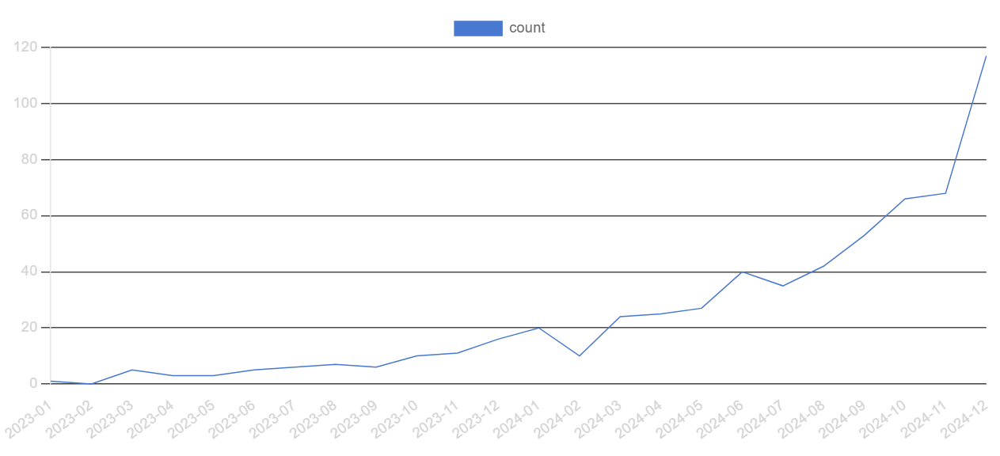
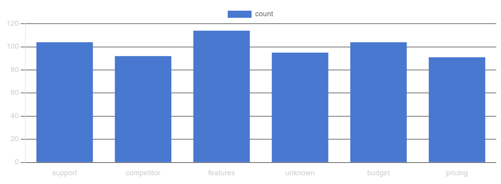

# SaaS Product Analysis &mdash; Findings

## Exploratory Analysis
### Signups
#### Signups Over Time (Monthly Basis)

There was a general upward trend in signups over the months of 2023 & 2024, with: 
- Notable signup peaks were observed in May, September, and November 2023, as well as March 2024
- Peak of 32 signups in November 2024, followed by a sharp 15-signup decline in December

### Subscriptions

#### Plan Tiers and Revenue
| Plan Tier | Monthly Revenue* | Annual Revenue* | Count |
|-----------|-------------|-----------|-----|
| Basic	| 760,437 | 9,125,244 | 1602 |
| Pro  | 	2,105,089 | 25,261,068 | 1675 |
| Enterprise | 8,473,221 | 101,678,652 | 1723 |

**Revenue figures represent aggregated totals across all subscriptions in each plan tier*

- **Enterprise Plan** accounts for the majority of total subscription revenue, contributing disproportionately more revenue relative to its subscription count
- Approximately 9.72% of recorded subscriptions have ended within the observed time window (2023-2024)

### Feature Usage
*💡 Feature IDs are anonymized in the dataset*
- Every user used one or more features 
- Feature 32 and Feature 12 were the most used features with 659 uses
- Feature 4 and Feature 26 recorded the highest error counts, suggesting potential usability or reliability issues
- Activation lag* is ~5.2 days 

**Activation lag is defined as the average number of days between account creation and first recorded feature usage*

### Support & Churn Signals

#### Support Ticket Findings
| Average Satisfaction | Response Time | Resolution Time |
|:---:|:---:|:---:|
| **3.98/5** ⭐ | **1-180 min** | **1-72 hrs** |

While average satisfaction is relatively high, response and resolution times vary significantly, indicating inconsistent support experience

#### Churn Events Over Time (Monthly Basis)

There was a gradual increase in monthly churn events from 2023 to 2024 with a significant spike in the last month.\
Notable increases appeared in June 2024 and sustained through October 2024, followed by a brief stagnation before the major December spike.

#### Reasons for Churn
General:

- 'Features' is the most frequently cited churn reason followed by 'Support' and 'Budget'

Significant spike month (Dec 2024):
- 'Budget' is the most frequently cited churn reason followed by 'Features' and 'Support'

### Summary
Overall, the exploratory analysis suggests that while user acquisition and revenue grew steadily, churn increased toward the end of the observed period. Feature-related issues consistently appear as a leading churn driver, with budget concerns becoming more prominent during peak churn months. These findings motivate deeper cohort-based retention and feature adoption analysis in subsequent sections.

-----------------------------------

