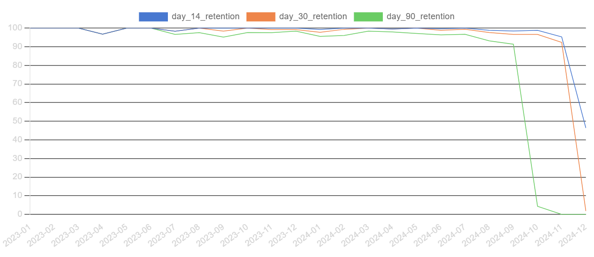
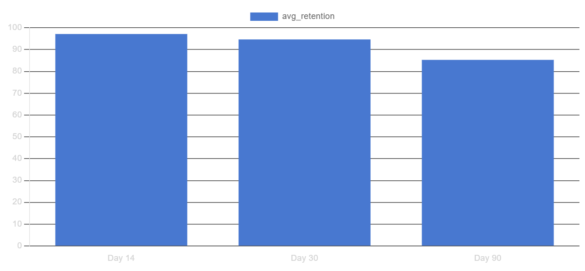
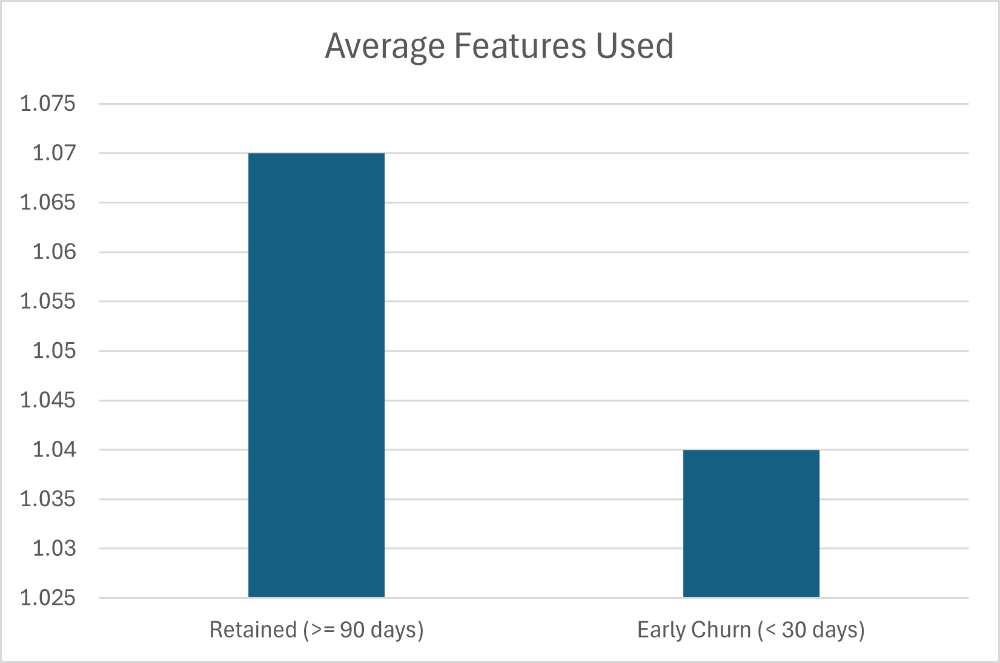
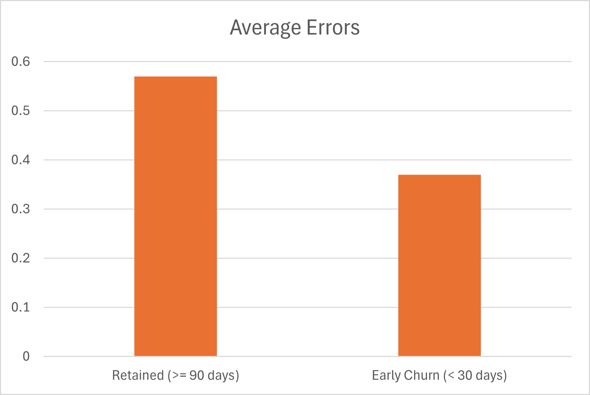
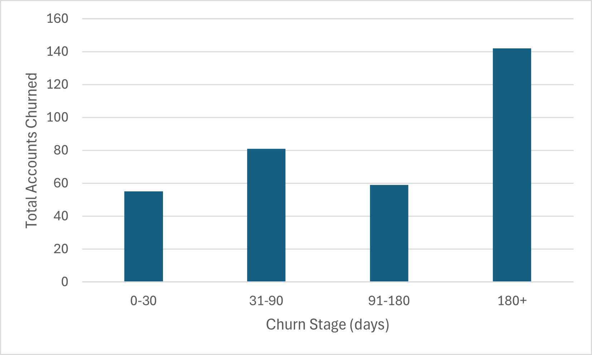

# SaaS Product Analysis &mdash; Findings

## Exploratory Analysis
### Signups
#### Signups Over Time (Monthly Basis)

There was a general upward trend in signups over the months of 2023 & 2024, with: 
- Notable signup peaks were observed in May, September, and November 2023, as well as March 2024
- Peak of 32 signups in November 2024, followed by a sharp 15-signup decline in December

### Subscriptions

#### Plan Tiers and Revenue
| Plan Tier | Monthly Revenue* | Annual Revenue* | Count |
|-----------|-------------|-----------|-----|
| Basic	| 760,437 | 9,125,244 | 1602 |
| Pro  | 	2,105,089 | 25,261,068 | 1675 |
| Enterprise | 8,473,221 | 101,678,652 | 1723 |

**Revenue figures represent aggregated totals across all subscriptions in each plan tier*

- **Enterprise Plan** accounts for the majority of total subscription revenue, contributing disproportionately more revenue relative to its subscription count
- Approximately 9.72% of recorded subscriptions have ended within the observed time window (2023-2024)

### Feature Usage
*💡 Feature IDs are anonymized in the dataset*
- Every user used one or more features 
- Feature 32 and Feature 12 were the most used features with 659 uses
- Feature 4 and Feature 26 recorded the highest error counts, suggesting potential usability or reliability issues
- Activation lag* is ~5.2 days 

**Activation lag is defined as the average number of days between account creation and first recorded feature usage*

### Support & Churn Signals

#### Support Ticket Findings
| Average Satisfaction | Response Time | Resolution Time |
|:---:|:---:|:---:|
| **3.98/5** ⭐ | **1-180 min** | **1-72 hrs** |

While average satisfaction is relatively high, response and resolution times vary significantly, indicating inconsistent support experience.

#### Churn Events Over Time (Monthly Basis)

There was a gradual increase in monthly churn events from 2023 to 2024 with a significant spike in the last month.\
Notable increases appeared in June 2024 and sustained through October 2024, followed by a brief stagnation before the major December spike.

#### Reasons for Churn
General:

- 'Features' is the most frequently cited churn reason followed by 'Support' and 'Budget'

Significant spike month (Dec 2024):
- 'Budget' is the most frequently cited churn reason followed by 'Features' and 'Support'

### Summary
Overall, the exploratory analysis suggests that while user acquisition and revenue grew steadily, churn increased toward the end of the observed period. Feature-related issues consistently appear as a leading churn driver, with budget concerns becoming more prominent during peak churn months. These findings motivate deeper cohort-based retention and feature adoption analysis in subsequent sections.

These exploratory patterns motivate deeper analysis into when users disengage and how early behavior relates to long-term retention, which is examined in the following sections.

-----------------------------------

## Retention Analysis

To monitor retention, retention cohorts was based on active subscription days, with checkpoints at Day 14, Day 30, and Day 90 to capture early behavior patterns.

### Cohort Retention Trends Over Time

Retention patterns remain broadly consistent across cohorts, with strong early retention (Day 14 and Day 30) observed throughout the dataset. Day 90 retention varies slightly by cohort but generally stabilizes at a lower baseline.

Apparent drops in later checkpoints for recent cohorts are driven by *limited observation windows* rather than true churn, as newer subscriptions have not yet reached later lifecycle stages.

### Average Retention by Lifecycle Checkpoint

Average retention remains high in the early lifecycle, with ~97% of subscriptions active at Day 14 and ~94% at Day 30. However, retention drops more sharply by Day 90, falling to ~85%.

This indicates that while initial activation is effective, a significant portion of users disengage after the first month. The **Day 30–90** window represents the most critical opportunity for improving long-term retention.

### Summary
These findings suggest that while the product successfully retains users in the early lifecycle, sustained value delivery beyond the first month is the primary driver of long-term retention and warrants deeper behavioral analysis.

----------------------------

## Feature Adoption & Retention

To understand behavioral differences between retained and early-churned users, feature usage during the first 14 days of subscription was analyzed. Subscriptions were grouped into:
- **Retained:** Active for 90 days or more
- **Early Churn:** Churned within the first 30 days

### Early Feature Breadth
Retained subscriptions used slightly more distinct features during the first 14 days compared to early-churned subscriptions.

- **Retained (≥90 days):** 1.07 features on average  
- **Early Churn (<30 days):** 1.04 features on average  

While the difference is modest, it suggests that retained users tend to explore the product marginally more during early onboarding.

However, the small magnitude of the difference indicates that feature breadth alone is **insufficient** to explain retention outcomes. 

### Early Usage Errors

Early-churned subscriptions experienced fewer errors on average during the first 14 days compared to retained subscriptions.

- **Retained (≥90 days):** ~0.57 errors on average  
- **Early Churn (<30 days):** ~0.37 errors on average  

This counterintuitive result likely reflects **higher overall engagement** among retained users. Users who interact more deeply with the product are exposed to more complex workflows, increasing the likelihood of encountering errors, while early-churned users may disengage before reaching these scenarios.

### Summary
Overall, early feature breadth shows only a weak correlation with long-term retention, while error counts appear to be more closely tied to engagement depth rather than product friction alone.

--------------------------------------
## Churn Analysis
### Churn Timing Analysis
Churn timing is measured at the **account** level, calculated from each account’s first subscription start date to its last churn date. This approach reflects the full customer lifecycle rather than individual subscription cycles.

While a meaningful number of accounts churn within the first 90 days, the largest share of churned accounts occurs after 180+ days, indicating that long-time customers also contribute substantially to overall churn volume.

The distribution indicates that churn is not limited to early onboarding failure.  Instead, it highlights the importance of **ongoing value delivery and expectation management**, not just early activation.

### Support Experience — Retained vs Churned Users

| Churn Status | Total Support Tickets | Average First Response Time (min) | Escalation Rate | Average Satisfaction Score |
|------------|---------------|-----------------------------|-----------------|------------------------|
| Retained         | 605           | 88.17                       | 3.97            | 3.98                   |
| Churned        | 1330          | 88.65                       | 5.26            | 3.98                   |

Churned accounts generated **more than twice** the number of support tickets, nearly identical average first response times and higher escalation rate compared to retained accounts.

Average satisfaction scores are approximately identical between retained and churned accounts, suggesting satisfaction scores alone may not fully capture underlying user frustration and hence reason for churn.

### Plan Activity Prior to Churn

To assess whether subscription instability precedes churn, recent upgrade and downgrade activity within 90 days prior to churn was examined for churned accounts.

| Plan Activity | Churned Accounts (%) |
| ------------- | -------------------- |
| Upgrade Plan | 20.50 |
| Downgrade Plan | 8.83 |

Across all churn events, about 20.50% of churned accounts had upgraded their plan shortly before leaving, while 8.83% had downgraded. 

The higher prevalence of upgrades relative to downgrades suggests that churn does not solely reflect cost-cutting behavior. Instead, a notable share of users appear to increase their commitment prior to churn, potentially indicating **expectation–value mismatches** after higher-tier adoption, where upgraded capabilities do not translate into perceived business value.

### Summary
Overall, these findings suggest that churn prevention should focus on ongoing value delivery, expectation management, and proactive support throughout the customer lifecycle, rather than solely on early activation.
